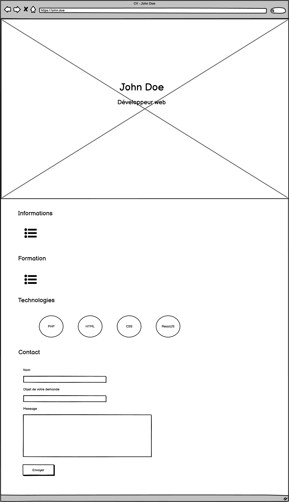

# My Digital School - B1 - HTML/CSS

## 24/09

## Introduction

HTML = HyperText Markup Language
CSS = Cascading StyleSheet

Client / Serveur => HTML = Programmation côté client (front-end)

## Structure

Un document HTML est une arborescence de balises.

```html
<!DOCTYPE html>
<html lang="fr">
  <head></head>
  <body></body>
</html>
```

- DOCTYPE = Le type de document HTML. Ici, HTML5
- `html` = balise racine de tout document HTML
- `head` = un des 2 enfants obligatoires de la balise `html`
- `body` = 2ème enfant obligatoire de la balise `html`

>`head` contient les **métadonnées** de la page, c'est-à-dire des informations sur la page HTML affichée.
>
>Cela peut être son titre (affiché dans les résultats d'un moteur de recherche ou bien dans l'onglet du navigateur), des ressources CSS externes à charger, etc...
---
>`body` contient le **corps** de la page, donc ce qui est affiché à l'écran

`html`, `head` et `body` sont ce qu'on appelle des **balises** (**tags** en anglais).

En HTML, on utilisera différentes balises pour structurer notre document.

Une balise contient une ouverture et une fermeture :

```html
<!-- La fermeture contient un '/' avant le nom de la balise -->
<balise>...</balise>
```

Il existe également des balises auto-fermantes. Il n'y a pas de femeture et le `/` se situe avant le `>` :

```html
<br />

```

## 01/10

Dans le corps de la page, nous avons vu plusieurs balises permettant de formater notre contenu :

- `p` pour écrire un paragraphe
- `h1` à `h6` pour écrire des titres (`h1` étant le titre le plus important)
- `br`, auto-fermante, pour effectuer un retour à la ligne

Il en existe bien sûr tout un tas d'autres :

### `nav`

La balise `nav` permet d'indiquer l'endroit où se trouve le menu dans notre arborescence.

Généralement, on va combiner `nav` avec `ul` pour réaliser une liste de liens. `ul` et `ol` se trouvent dans la section suivante.

Notez bien qu'on pourrait tout à fait réaliser un menu sans la balise `nav`. Cependant, gardez en tête que l'utilisation de `nav` est bien meilleure d'un point de vue **sémantique**, c'est-à-dire de structure de notre page.

Une liste simple au milieu de la page a moins de sens pour un moteur de recherche. Englober cette liste avec `nav` permet de mieux structurer la page.

### `ul` et `ol`

`ul` et `ol` permettent de faire des listes.

- ul = unordered list, pour réaliser une liste non numérotée
- ol = ordered list, pour réaliser une liste ordonnée, numérotée

Dans `ul` et `ol`, on trouvera **toujours** des **éléments** de liste : des "list items", ou encore `li`.

Puis dans un élément de liste, on pourra mettre d'autres balises, comme des liens hypertextes.

### `a` : ancre ou lien hypertexte

La balise `a` doit avoir au moins un attribut pour nous permettre de naviguer : `href`.

```html
<a href="https://github.com">Cliquez ici pour aller sur Github</a>
```

On a également vu qu'on pouvait forcer l'ouverture du lien dans un nouvel onglet, en ajoutant l'attribut `target` avec la valeur `_blank` :

```diff
-<a href="https://github.com">Cliquez ici pour aller sur Github</a>
+<a href="https://github.com" target="_blank">Un clic sur ce lien s'ouvrira dans un nouvel onglet</a>
```

### `table` : présenter des données sous forme de tableau

Un tableau en HTML se présentera **toujours** sous l'arborescence suivante :

`table` > `tr` > `td`

La balise `table` permet d'ouvrir le tableau. Ce tableau contiendra ensuite des **lignes** (`tr`, ou encore *table row*), qui elles-mêmes contiendront des données (`td` ou bien *table data*).

> Fichier : `produits.html`

```html
<table>
  <!-- Ligne -->
  <tr>
    <!-- En-têtes, titre des colonnes -->
    <th>Nom</th>
    <th>Image</th>
    <th>Prix</th>
    <th>Actions</th>
  </tr>
  <!-- Autre ligne -->
  <tr>
    <!-- Donnée -->
    <td>iPhone X</td>
    <td>
      
    </td>
    <td>850€</td>
    <td>
      <a href="https://amazon.com" target="_blank">Commander</a>
    </td>
  </tr>
</table>
```

### `div` : l'élément de division de contenu

La balise `table` peut être utile pour présenter des données de manière structurée, mais malheureusement n'est pas assez flexible pour nous permettre d'adapter l'affichage, par exemple, selon la taille de l'écran de l'utilisateur.

Cependant, nous avons besoin de structurer nos données, de les **découper**, les isoler, pour effectuer notre intégration.

Ainsi, en HTML, une balise *générale* de division de contenu existe : `div`.

Contrairement à des balises comme `p`, `h1` ou `table`, la balise `div` a une vocation plus **généraliste**. Elle va nous permettre de **structurer** notre code pour pouvoir le styliser plus efficacement ensuite, avec CSS.

> Fichier : `produits_div.html`

```html
<div id="products-list">
  <!-- Produit -->
  <div>
    <h2>Nom du produit</h2>
    <div>
      
    </div>
    <div>
      Prix du produit €€€
    </div>
    <div>
      <a href="https://amazon.com" target="_blank">Commander</a>
    </div>
  </div>
  <!-- /Produit -->
</div>
```

## 06/10

### Eléments de type `block` et `inline`

Chaque élément a en HTML un type `block` ou `inline`.

- Un élément `block` va occuper tout l'espace horizontal disponible (toute la largeur de la page) et l'élément suivant sera sur une nouvelle ligne
- Un élément `inline` ne va occuper que l'espace requis par son contenun et l'élément suivant sera sur la même ligne

Quelques exemples :

| `block` | `inline` |
|---|---|
| p, div, h1...h6 | img, a, span |

### CSS - Introduction

Un ensemble de règles CSS définies dans un fichier va nous permettre de **styliser** les éléments HTML de notre page.

Pour ce faire, on va devoir **cibler** les éléments pour leur appliquer un style particulier.

On va créer un fichier CSS contenant les règles à appliquer.

Ensuite, on va **intégrer** ce fichier à notre fichier HTML avec la balise `link` :

>Fichier : `index.html`

```html
<!DOCTYPE html>
<html lang="fr">
  <head>
    <!-- ... -->
    <link href="styles.css" rel="stylesheet" />
    <!-- ... -->
  </head>
  <body>
    <!-- ... -->
  </body>
</html>
```

Syntaxe CSS :

```css
/* Commentaire */
selecteur {
  regle: valeur;
}
```

Le sélecteur va nous permettre de cibler le ou les éléments sur lesquels appliquer nos règles.

Si je veux cibler une balise HTML, comme `body` par exemple, il me suffit d'indiquer le nom de la balise :

```css
body {
  color: blue; /* Couleur du texte */
}
```

Ou bien une balise `a` :

```css
a {
  text-decoration: none; /* ne pas souligner le lien */
}
```

Mais si je souhaite être plus spécifique sur l'élément à sélectionner, par exemple si je ne veux pas que tous mes liens n'aient plus de soulignage, je peux utiliser les attributs HTML dans ma page :

```html
<a href="#page-top" id="link-top">Retour en haut</a>
```

Ici, on a déclaré que le lien avait un identifiant dans la page, `link-top`.

On peut donc déclarer, dans le fichier CSS, un ensemble de règles qui vont s'appliquer uniquement à `link-top`.

En CSS, pour désigner un élément par son ID, on indique son nom précédé d'un `#` :

```css
#link-top {
  text-decoration: none;
  /* En majuscules */
  text-transform: uppercase;
  /* Code couleur : Rouge, Vert, Bleu (RVB) */
  background-color: #4c5fff;
  color: #FFF;
  /* Marges intérieures */
  padding: 7px;
  /* Coins légèrement arrondis */
  border-radius: 3px;
}
```

>**Un ID doit être unique dans la page**

## 08/10

### Le modèle Flexbox

Nous avons vu que les éléments HTML pouvaient être de type `block` ou `inline`.

La règle CSS correspondant à ce type d'affichage est `display`.

On peut également utiliser `display` pour d'autres types d'affichages. Nous allons parler du type `flex`.

Le modèle Flexbox permet, quand il est appliqué sur un conteneur, d'agir sur l'organisation de son contenu, c'est-à-dire ses balises enfants.

Exemple :

```css
#bg-image {
  /* Utilier Flexbox pour cet élément */
  display: flex;
  /* Afficher les enfants de cet élément les uns après les autres, en colonne  */
  flex-direction: column;
  /* Centrer les éléments enfants horizontalement */
  align-items: center;
  /* Centrer les éléments enfants verticalement */
  justify-content: center;
}
```

### Les unités de mesure en CSS

Il existe de nombreuses unités de mesure en CSS. Nous ne les verrons pas toutes dans ce module, uniquement les plus couramment utilisées.

- **px** : le pixel, pour fixer précisément la taille d'une police de caractère ou d'un élément, d'une marge, etc...
- **vh** : viewport height. Un pourcentage de la taille de l'écran de l'utilisateur. On va utiliser par exemple `height: 100vh;` quand on voudra qu'un élément prenne toute la hauteur de l'écran
- **em** : Une unité de mesure relative à la taille de base de la police de caractères

> Exemple concernant `em` :

```css
body {
  /* On fixe une taille de base de 18px pour le corps de notre page */
  font-size: 18px;
}

h1 {
  /* A l'affichage, le navigateur va prendre la taille de base (18px), et la multiplier par 5 */
  font-size: 5em;
}

h2 {
  /* Idem, taille de base x 3 */
  font-size: 3em;
}
```

>L'unité de mesure `em` va donc nous permettre de nous exprimer en valeur **relative** plutôt que de devoir fixer toutes les tailles de police par exemple. On peut utiliser `em` quand on définit des tailles de marge, également

### Les sélecteurs en CSS

Il y a différentes manières de cibler un ou plusieurs éléments en CSS, lorsqu'on écrit un **sélecteur**.

#### Balise HTML

La première qu'on a vue, la plus simple, consiste à définir un ensemble de règles CSS pour une balise HTML. Dans ce cas, on écrit simplement le nom de la balise, sans rien d'autre.

```css
h1 { /* ... */ }
p { /* ... */ }
a { /* ... */ }
```

#### Balise ayant un ID

Précéder le nom de l'identifiant du caractère `#`.

```css
#identifiant { /* ... */ }
```

#### Elément se trouvant **dans** un autre élément

Indiquer le nom des éléments, **en partant du parent**, séparés par un espace.

```css
parent #enfant autre-enfant { /* ... */ }
```

#### Elément ayant une **classe**

Précéder le nom de la classe d'un point `.`

```css
.classe { /* ... */ }
```

### La différence entre ID et classe

- Un ID pour un élément est unique dans toute la page. On peut cibler un élément qui a un identifiant avec le caractère `#` en CSS. L'attribut HTML à utiliser pour attribuer un identifiant à un élément est `id`
- Une classe permet de réutiliser le même nom pour plusieurs éléments dans la page. Du point de vue de CSS, on pourra donc parler de **classe d'affichage**.

Exemple de classe : je souhaite pouvoir afficher certains éléments de ma page en texte de couleur blanche. Je peux donc définir une classe d'affichage en CSS, qui aura la règle CSS `color: white`, puis je pourrai utiliser cette classe dans ma structure HTML :

>CSS

```css
/*
Classe d'affichage :
Utilisable sur plusieurs éléments
*/
.white-text {
  color: #fff;
}
```

>HTML

```html
<h1 class="white-text">John Doe</h1>
<h2 class="white-text">Développeur web</h2>
```

### Début de réalisation d'un CV

Avant de se lancer, réalisons une maquette simple, sous forme de mockup :



La partie supérieure devra occuper toute la hauteur de l'écran de l'utilisateur, comme pour présenter un écran d'accueil à l'arrivée sur la page.

### Partie supérieure : image d'arrière-plan, centrage des éléments

Lorsqu'on a une maquette comme celle qui se trouve juste au-dessus, on souhaite réaliser ce qu'on appelle un **découpage**.

Le découpage consiste simplement à identifier les différentes parties de la page à réaliser, afin de les *traduire* en balises HTML.

Par exemple, pour la partie supérieure de la page :

- Nous allons avoir besoin d'un conteneur qui présentera l'image en arrière-plan
- Le nom du développeur sera un titre de premier niveau (`h1`)
- Le sous-titre sera donc un titre de second niveau (`h2`)

Le conteneur qui va présenter l'image n'a pas réellement de **valeur sémantique**.

>Cela signifie que l'on ne va pas spécialement utiliser une balise de titre, de paragraphe, de lien, etc...

On va donc utiliser une balise `div` et lui appliquer une série de styles. Pour la cibler spécifiquement, on lui a appliqué l'identifiant `bg-image`.

Voir le fichier [cv.css](cv.css) avec les commentaires pour avoir le résumé des règles CSS utilisées.

## 13/10

### Formulaires : introduction

Un formulaire aura toujours pour balise racine la balise `form` :

```html
<form>
  <!-- ... -->
</form>
```

Une fois qu'on a ouvert notre formulaire, on va ajouter des champs dedans :

```html
<!-- Exemple de formulaire de recherche -->
<form>
  <input type="text" name="search" />
  <input type="submit" value="Rechercher" />
</form>
```

>Les balises `input sont auto-fermantes`.

## 15/10

### Chemin relatif - Remonter d'un niveau

Nous avons déjà vu qu'un chemin relatif s'exprimait en prenant pour point de départ notre fichier courant.

Ainsi, si je suis dans `index.html` et que je souhaite intégrer ma feuille de style `styles.css` qui se trouve dans le dossier `css`, je peux écrire mon chemin relatif : `css/styles.css`.

Mais si je suis dans `css/styles.css` et que je veux déclarer une image d'arrière-plan qui se trouve non pas dans `css`, mais dans `images`, dossier au même niveau que `css` ?

Relativement au dossier `css`, je peux indiquer au navigateur d'aller chercher l'image en remontant d'un niveau. Pour cela, on va utiliser la syntaxe `../`.

Mettons qu'on a la structure suivante :

```txt
css/
  styles.css
images/
  bg.jpg
```

Alors, dans ma feuille de style, je peux référencer l'image `bg.jpg` de la manière suivante :

```css
#mon-selecteur {
  background-image: url(../images/bg.jpg);
}
```
